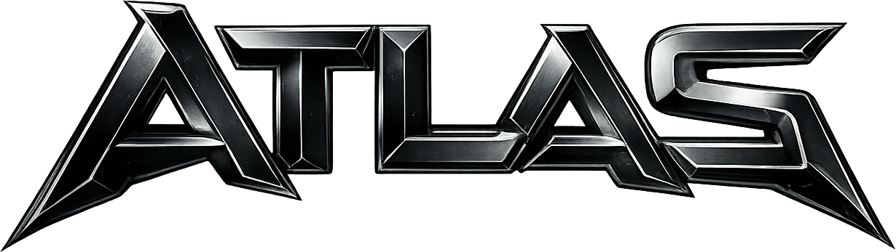

  

---

<h1 align="center">Atlas?</h1>

Atlas is a free and keyless script developed for the Roblox game Murder Mystery 2.

---

This project is not for sale and may not be used or distributed for commercial purposes.

